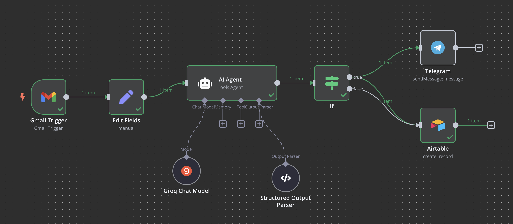

# Workflow Automation
For this project I use cloudflare to host n8n, you should prepare a domain and create a tunnel to get `TUNNEL_TOKEN` and subdomain put in `N8N_HOST` + `WEBHOOK_URL` in `env`.
## Gmail summarized workflow

You can implement it from `Email_Summarize.json` in `workflows`.
